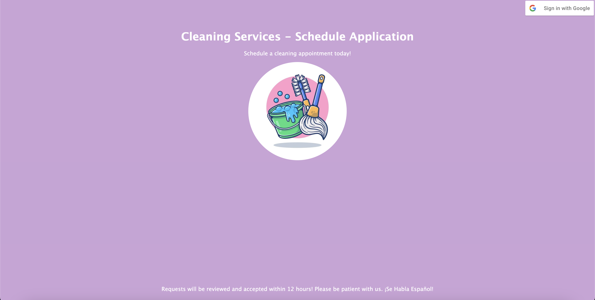
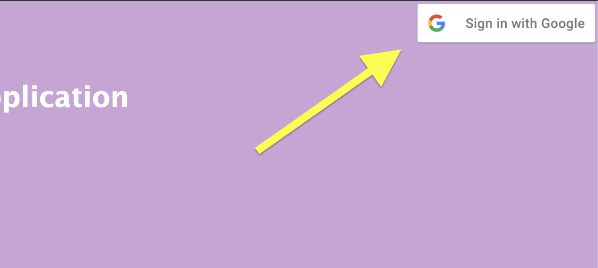
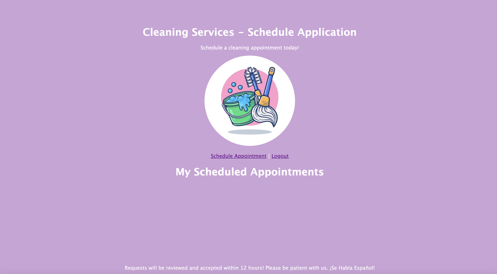
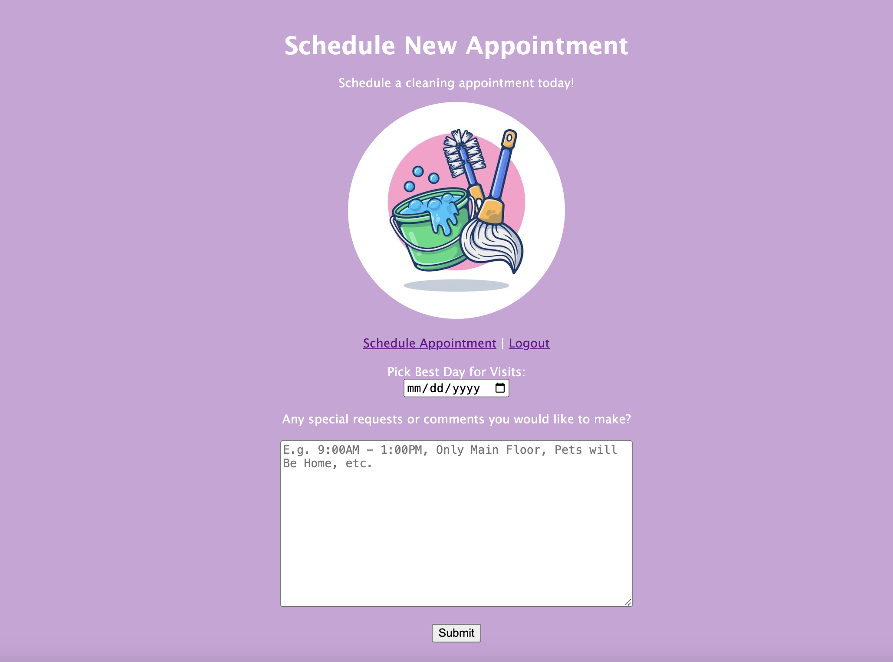
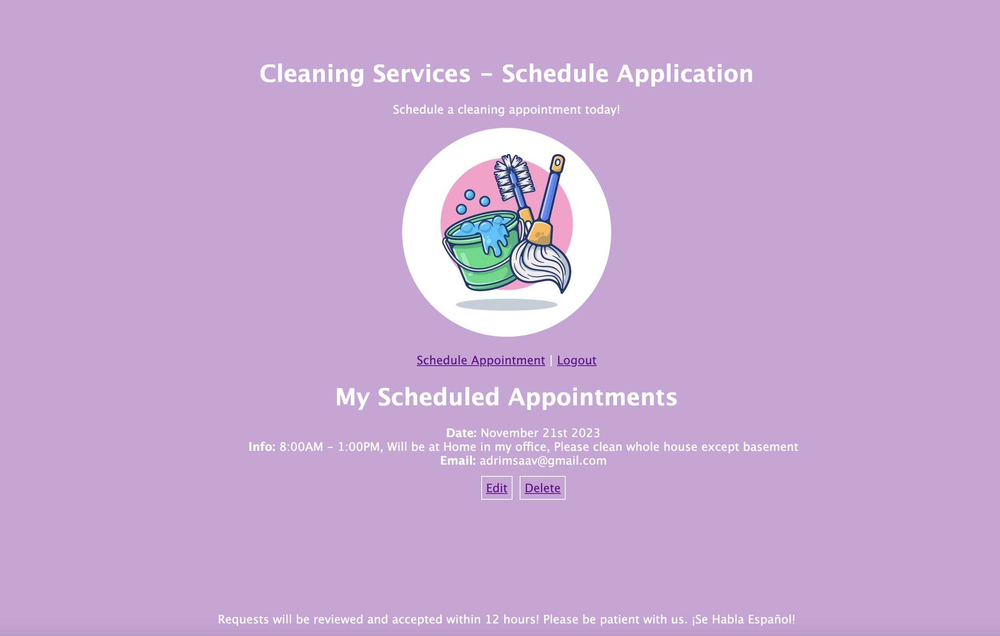
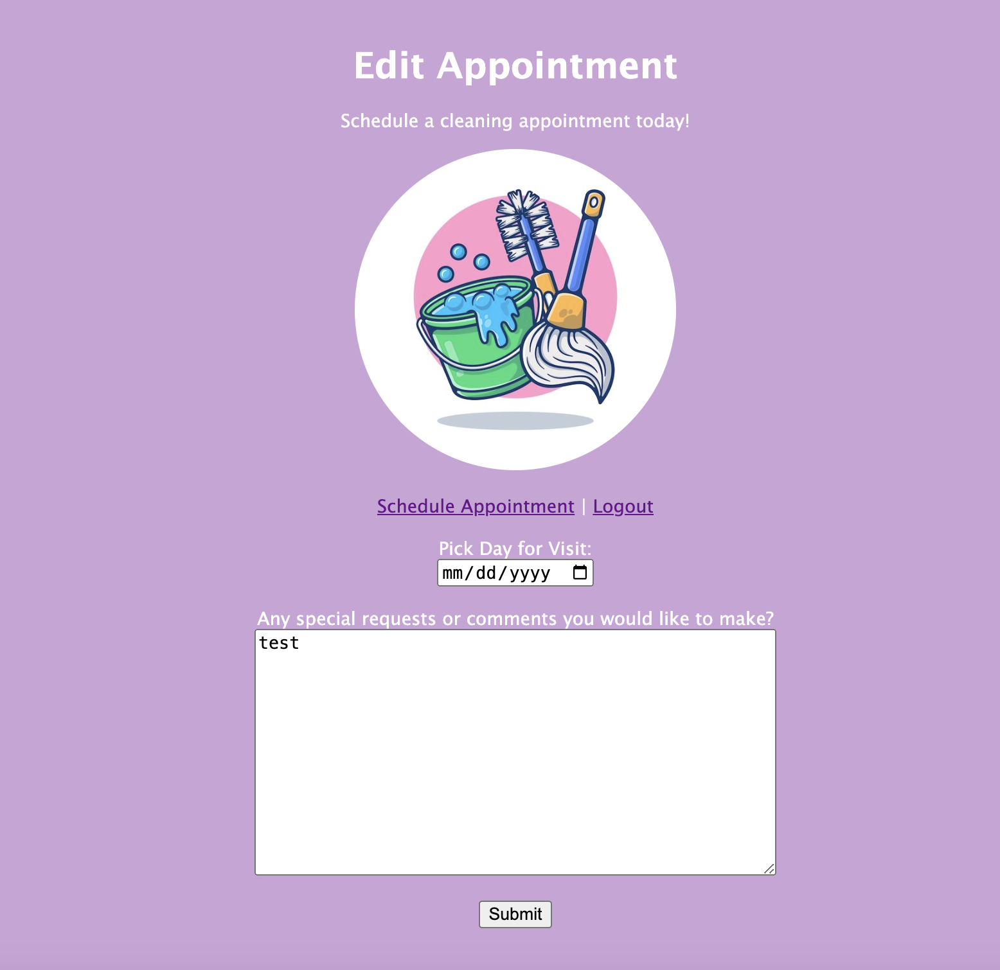
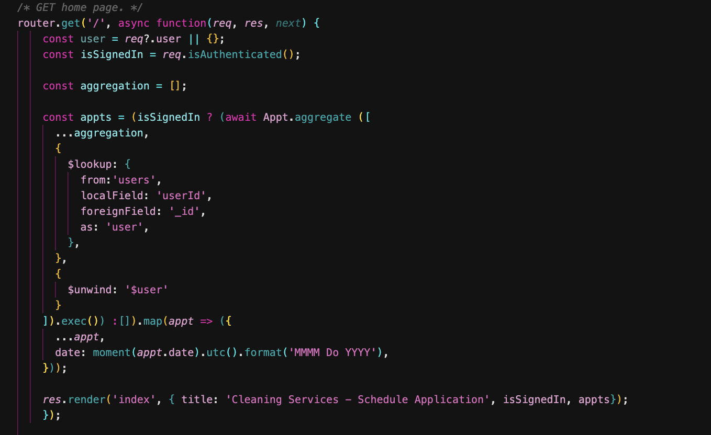
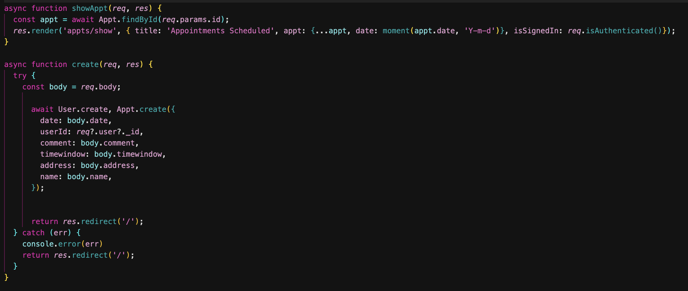
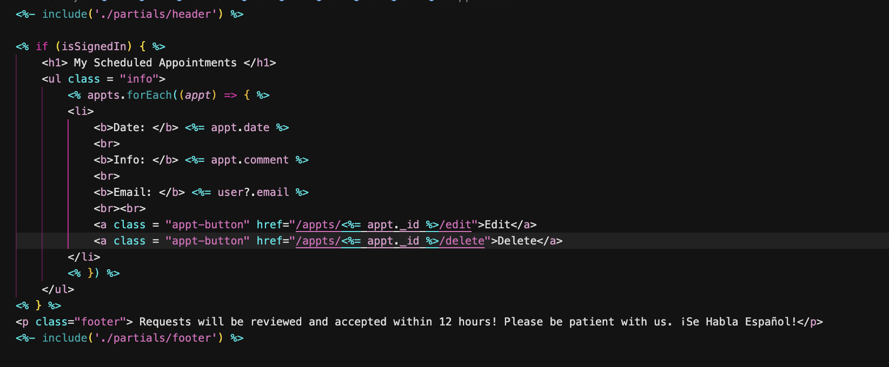

# Full-Stack CRUD Application - Scheduling App

My application is a scheduling app meant for cleaning services. Clients are able to sign in with their Google accounts and schedule their appointments, adding their availability and the time windows that fit with their schedule.

# Screenshots

First image is the homepage of the application.

Google Sign-In button can be found on right corner of the screen.

The second image is the Google Sign-In, where you see it continues to the site, "Cleaning Services".

Image above is the homepage but signed in. The navigation menu bar has been shown to the user, and the options "Schedule Appointment" and "Logout" are shown. At the bottom is a message telling user that appointment requests will be reviewed within 12 hours.

This next image shows the "New Schedule Appointment" page. You can choose what date to have your appointment, and add information to the text box. This is preferred for now, and will be explained later on.

Appointment has now been listed. The Edit and Delete button are now shown beneath the logo and navigation menu bar.

Edit Appointment page has now been displayed after clicking "Edit" button. You can change the date and once again, the textbox appears.

Logging out is also possible, and only one appointment can be made at a time. This project was definitely difficult for me, trying to navigate what to enter in routes and controllers, as well as incorporting Google OAuth.

# Technologies Used

For this application, I used:
- Javascript, 
- HTML, 
- Mongoose, 
- MongoDB, 
- EJS, 
- Express.js, 
- Node.js, 
- Google OAuth, and 
- Passport

Google OAuth was used for clients to sign in with their accounts.

# Challenging Code Parts 

The routes/index.js and controllers/appts.js files were the most difficult for me. I needed assistance with these fragments of code, did a lot of research, asked experienced software engineers, and still don't quite understand how it works. I'm glad it does, but my app still looks very simplistic. I wanted to incorporate a lot of things, but these files drained me. I couldn't add everything I wanted to, and some objects in the models/user.js file were never called.

Above is routes/index.js for the GET route for homepage.

Above is the controllers/appts.js file. The create function was a nightmare!

# Favorite Lines of Code 

This HTML code from views/index.ejs file was my favorite because it's one of the few fragments of code I understand and could do myself.

# Next Steps

- Add hopefully an admin board
- Add different textboxes for time window preferred, name of person making appointment, etc.
- Stylize the page better